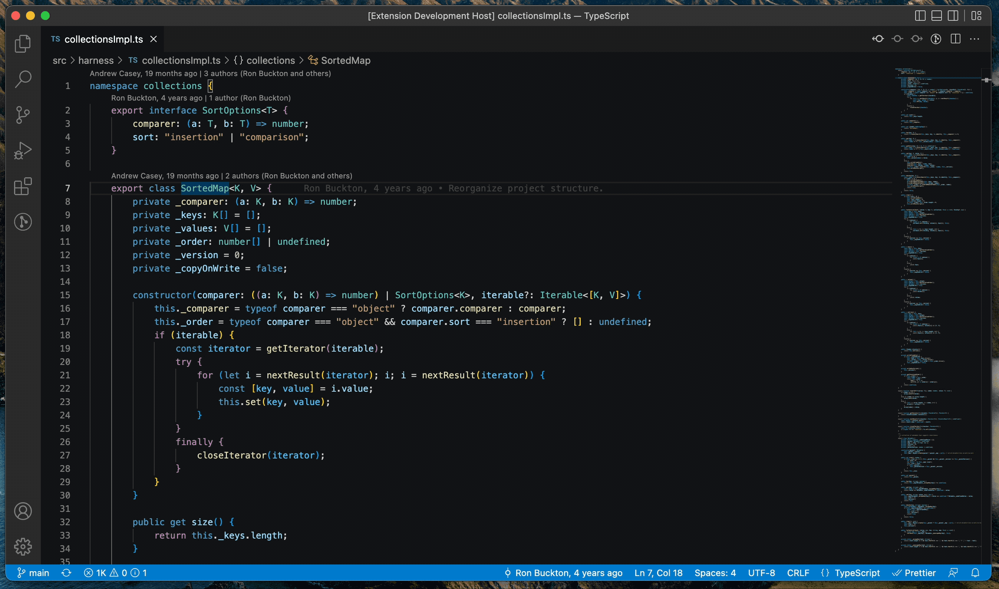

# VSCode Quick Grep

Git Grep and Ripgrep extension for Visual Studio Code. Easy to search code, see results, and navigate with the quick pick view. A selected text will be used to grep by default.

The default shortcut is `Cmd + E`. 

**Install Ripgrep**

If you're a macOS Homebrew or a Linuxbrew user,
```
brew install ripgrep
```
Otherwise, check [this link](https://github.com/BurntSushi/ripgrep).


### Usage

- Trigger `Cmd + E` to open the Quick Grep
- Type a text to search. If there is a selected text in the editor, that text will be used for searching.
- The last results will be shown by triggering `Cmd + E` again without a selected text. It's a handy way to continue browsing.
- Optionally, you can enable the preview setting to see the file content while browsing search results.



## Extension Settings

| Setting             | Description                                                            | Type    | Default Value |
| ------------------- | ---------------------------------------------------------------------- | ------- | ------------- |
| `quickgrep.preview` | Show the preview when the item is selected.                            | boolean | false         |
| `quickgrep.grep`    | Select a command to grep. Git grep only works within a git repository. | boolean | false         |

## Commands

```json
"commands": [
  {
    "command": "quickgrep.action",
    "title": "Quick Grep"
  }
]
```